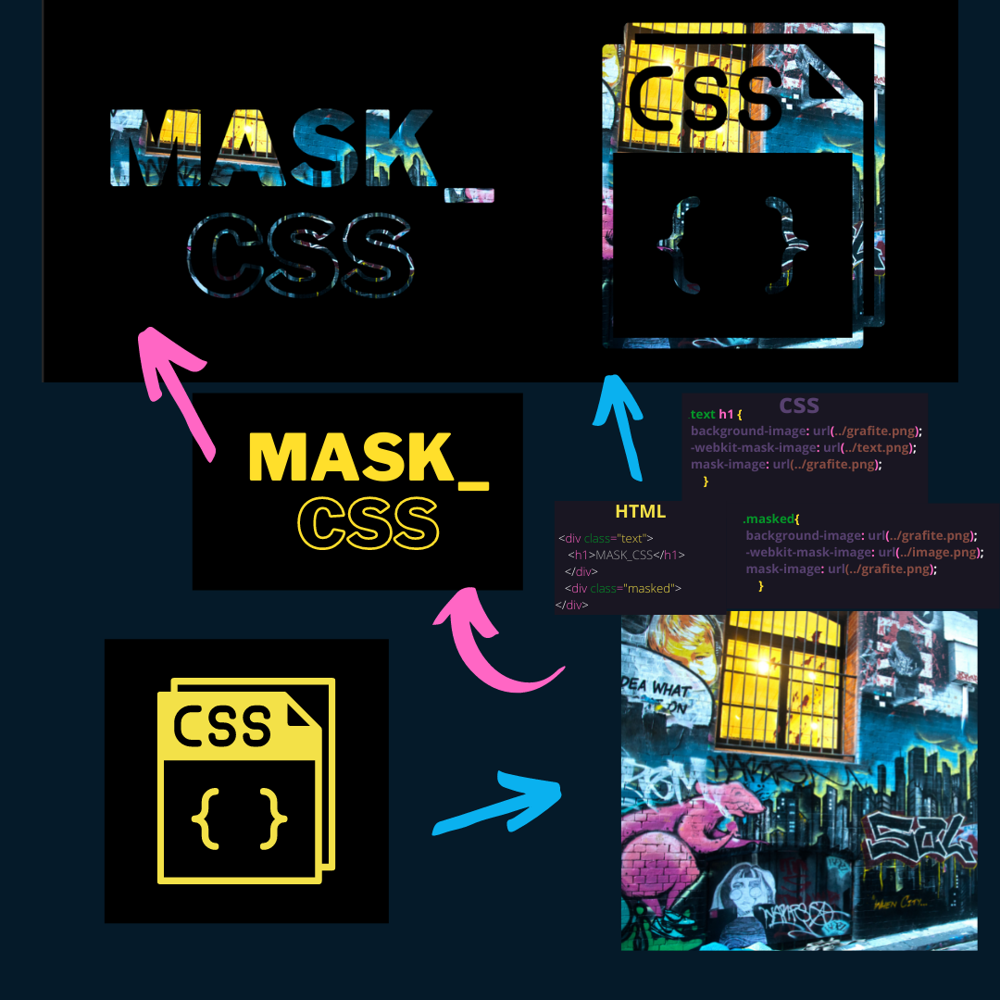

# Mask 🎭
##📃Acesse o  <a href="https://luvalentinaa.github.io/mask_css/" target="_blank">Github Pages</a>
## Máscara em CSS é usada para ocultar um elemento usando o recorte ou mascarando a imagem em pontos específicos.
[

